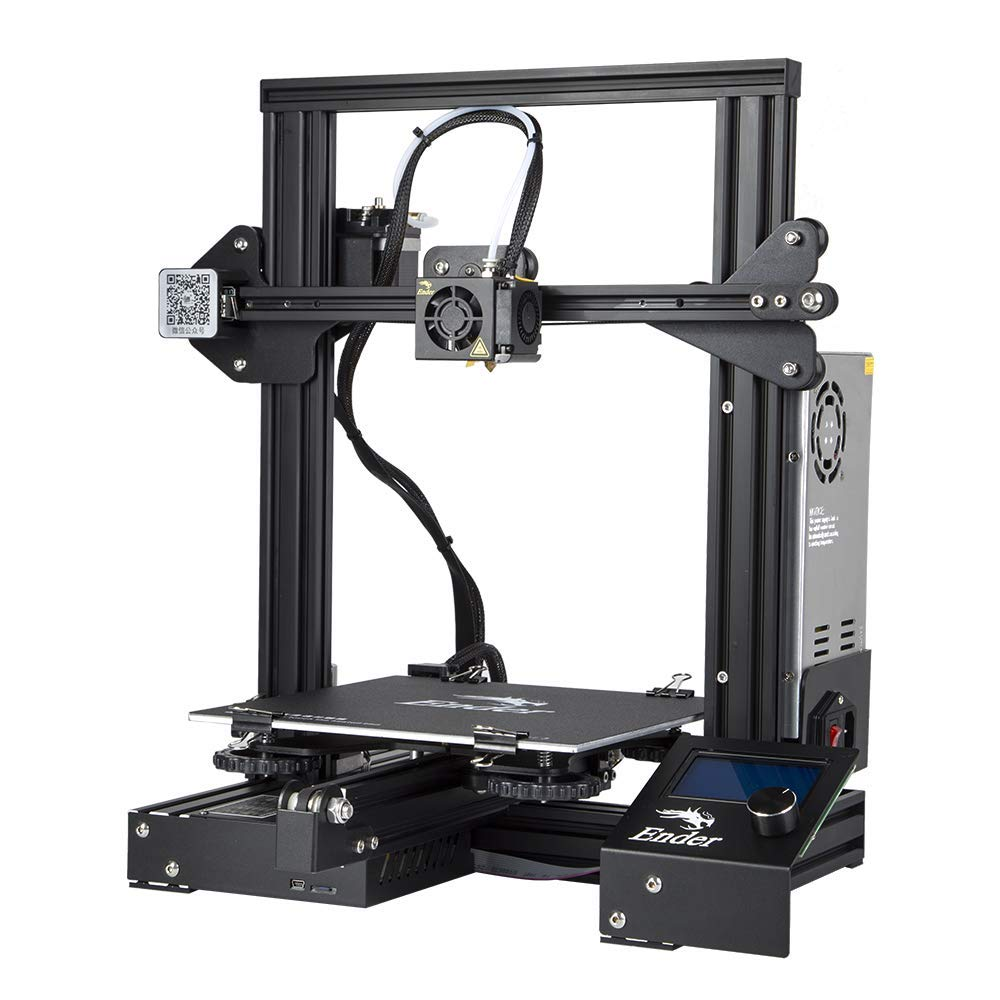
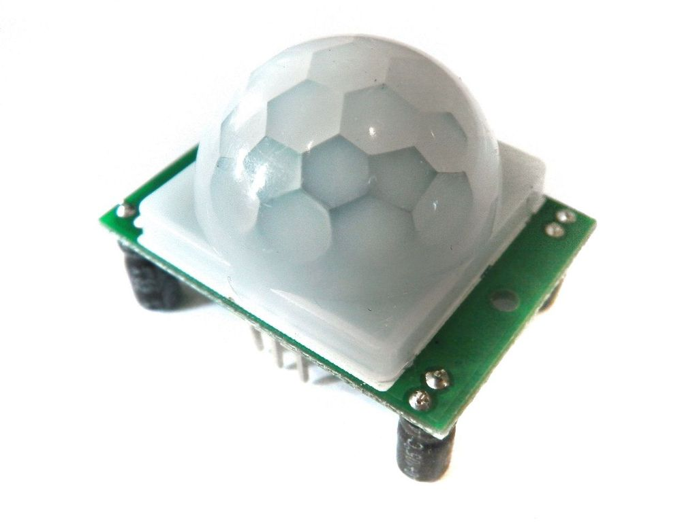

# Una pequeña referencia sobre mi

Para resumir, soy un maker que por alguna razon aparente tiene conocimientos sobre software

### Alguien que conozco una vez dijo:
>La forma mas facil para llegar a la sabiduria es ...
>leyendo la documentacion oficial
> - Eneldo Serrata

# Certificaciones:
- Ensamblador de productos electrónicos básicos (ITESA) 
- Electrónico reparador industrial (ITESA)
- Reparador de computadoras y periféricos (ITESA)
- Instalador Reparador De Sistemas Electrónicos de Control (ITESA)
- Electricista Instalador Residencial Y Comercial (ITI)
- Electricista Instalador Industrial (ITI)
- Electricista en controles eléctricos industriales (ITI)

# Impresion 3D:

todo lo concerniente a impresion 3D lo pueden encontrar en la siguiente pagina:

* [3DimentionalWorks](https://www.instagram.com/3dimentionalworks/)

# Repositorios con una documentacion decente:

<!-- 

* [RF Project](https://mikehiciano.github.io/rfproject/)
 [in progress] -->

* [Yi Shooter](https://mikehiciano.github.io/yi_shooter)

<!-- 

* [SecuriBudge](https://mikehiciano.github.io/securibudge)
[in progress] -->