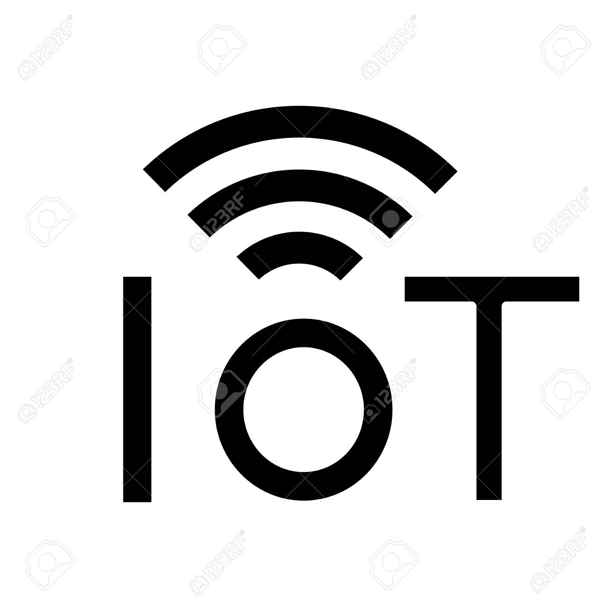

# Welcome to Mike Hiciano's Github Pages

This is a space to organize (in some way) my projects.

# Repositories with a descent documentation:

* [IoT For Dummies Examples](https://mikehiciano.github.io/iot-for-dummies-examples/) 

* [RF Project](https://mikehiciano.github.io/rfproject/)

* [Yi Shooter](https://mikehiciano.github.io/yi-shooter)